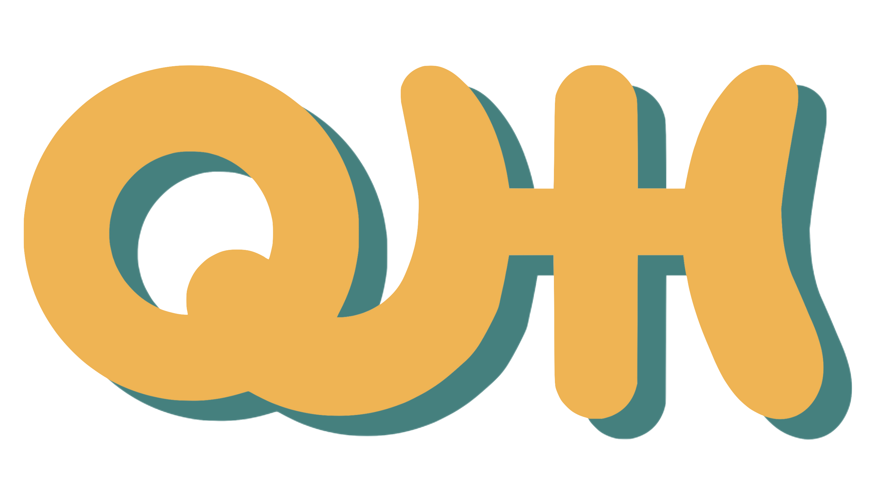
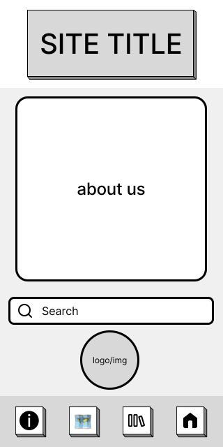
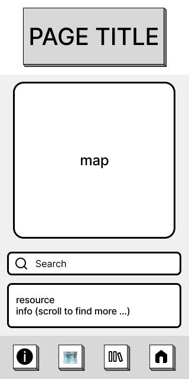
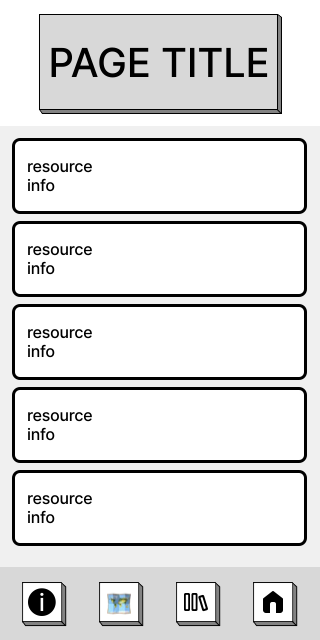
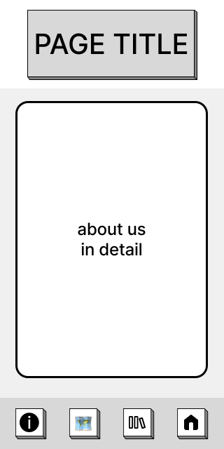
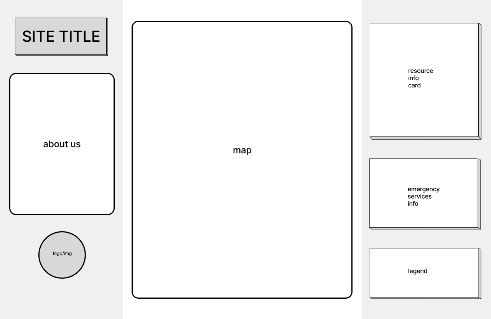
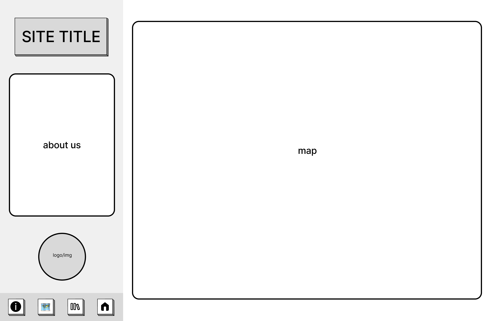
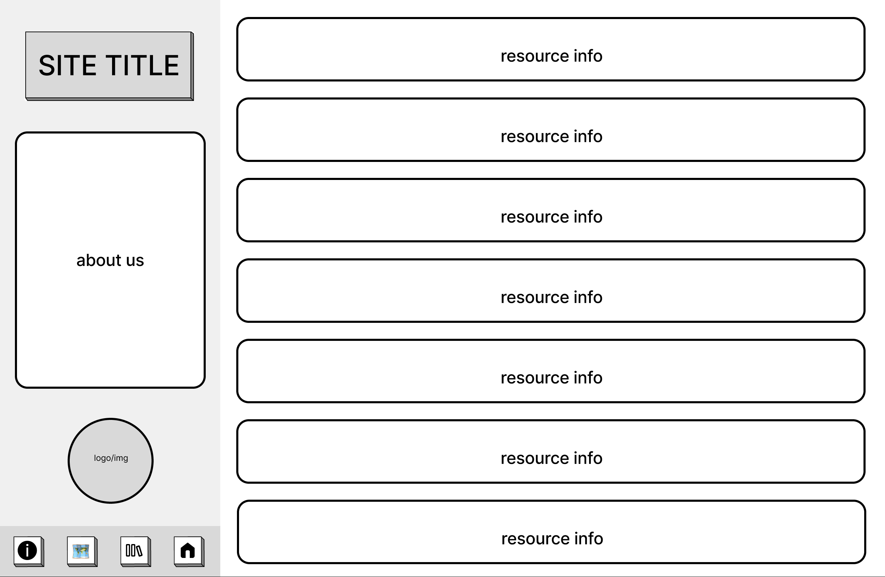
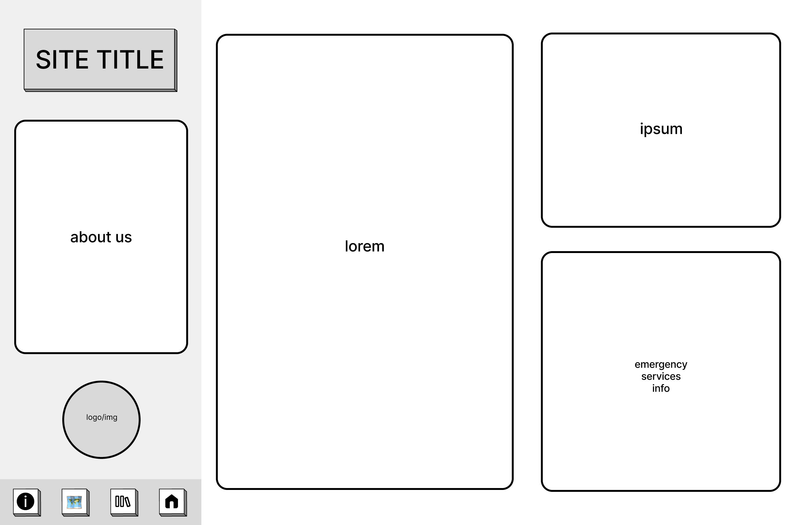

# Project Title
**Queer Health Hub (QHH)**


## Overview
Queer Health Hub is a local resource for 2SLGBTQIA++ people in the City of Toronto that aims to increase access to information, resources, and healthcare service providers. 

### Problem
2SLGBTQIA++ people experience more barriers accessing quality and safe healthcare. QHH aims to close this care gap by helping users navigate their local healthcare systems. Information regarding resources, procedures, providers, and locations will be centralized into one spot for the user to browse freely. 

### User Profile
The primary demographic is the Queer and gender expansive community and anyone within the 2SLGBTQIA++ acronym. Particularly, this app aims to be a safe and caring space for those in the transgender and intersex communities as anti-trans rhetoric continues to rapidly grow. The app will also list Indigenous and non-Western forms of medicine. The Queer Health Hub app is built on the foundations of intersectionality, consent-based care, and queer safety. 

### Features
The user will be directed to the landing page at app start. On the mobile site, the user will be able to read a description of the app and then choose between searching for a specific resource or navigating to a different page (map view, list view, or more details about site). On the desktop site, the user will see all functionality within the one page with the additional option to navigate to a list only view, a map only view, or further details about the app, app creator, and future directions. 

**From left to right are the following three sections on desktop width:**
1. **Site Information:** The site information will include the logo, about, and search bar.
2. **Map View:** The middle section will be a map where the user can see pins of the resources.
3. **Resource View:** The resource view will include a resource details card, an emergency services information card, and a legend for the map and site. 


## Implementation

### Tech Stack 
- VS Code
- GitHub
- MySQL
- npm
- react-router-dom
- sass
- express
- nodemon
- cors
- dotenv
- knex
- axios
- @mui/base
- @vis.gl/react-google-maps

### APIs
- [Google Maps API](https://developers.google.com/maps/documentation) or [Mapbox API](https://docs.mapbox.com/api/overview/)
- Queer Healthcare Database (self-created seed file)

### Sitemap
The site will have a mobile and desktop width.

The **mobile site** will have the following pages:
- Landing Page
- Map View Page
- List View Page
- More Details Page

The **desktop site** will be one screen split into three sections (from left to right) with additional pages for the map only view, list only view, and about details:
- Desktop Home Page:
    - Site title and information
    - Map View Section
    - Resource Information Section
- Map View Only Page
- List View Only Page
- About Only Page

### Mockups
**Mobile Width:**






**Desktop Width:**






### Data 
The data comes in two general types:
1. Map details (include map location)
2. Provider/resource details (including provider/resource locatio)
The location of the provider/resource will be determined and pinned to the map. Users can click on this pin and see additional details for the provider/resource. The map data relies on the Google Maps API and the map pin location of the provider relies on the address/location in the self-created database. 

### Endpoints
Endpoints that my server will implement:
- GET "/" -> list of all provider/resource locations, seen in map view
    - Returns 200 if successful
    - Example response:
    ```
    [
        {
            id: 1,
            resource_name: Sherbourne Health,
            resource_address: 333 Sherbourne Street
        },
        {
            id: 2,
            resource_name: Woman's College Hospital,
            resource_address: 76 Grenville Street
        },
        ...{}, ... {}
    ]
    ```

- GET "/resources" -> list of all provider names and type, accordian style (expansion shows provider details/further information on the provider)
    - Returns 200 if successful, 404 if list of resources is not found
    - Example response:
    ```
    [
        {
            id: 1,
            resource_name: Sherbourne Health,
            resource_type: ["Primary Care", "Mental Health", "Trans Health Care", "Post-Surgical Support", "Information & Knowledge"]
        },
        {
            id: 2,
            resource_name: Woman's College Hospital,
            resource_type: ["Sexual Health", "Endocrinology", "Primary Care", "Indigenous Health", "Gynecology", "Mental Health"]
        },
        ...{}, ... {}
    ]
    ```

- GET "/resources/:id" -> details for a specific provider (what is shown on toggle in accordian)
    - Returns 200 if successful, 404 if id not found
    - Example response:
    ```
    [
        {
            id: 2,
            resource_name: Woman's College Hospital,
            resource_type: ["Sexual Health", "Endocrinology", "Primary Care", "Indigenous Health", "Gynecology", "Mental Health"]
            resource_treatment_options: ["Gender Transition Encodrinology Care", "Mastectomy", "Chest Contouring", "Breast Augmentation", Hysterectomy", "Bilateral Salpingo-oopherectomy", "Orchiectomy", "Scrotectomy", "Vaginoplasty", "Vulvaplasty"]
            resource_website: "https://www.womenscollegehospital.ca/",
            resource_address: 76 Grenville Street,
            resource_phone: 416-323-6400,
            resource_email: "",
            resource_hours: "Department Dependent",
            resource_navigation_accessibility: ["Subway", "Streetcar", "Bus", "Walking"],
            resource_accessible: "Yes",
        },
        ...{}, ... {}
    ]
    ```

- GET "/resources/:type" -> returns a list of resources for a specific type of healthcare (eg. transgender care, mental health resources, queer-friendly GPs, etc.)
    - Returns 200 if succssful, 404 if resource_type not found
    - Example response:
    ```
    [
        {
            id: 1,
            resource_type: "Primary Care",
            type_providers: ["Sherbourne Health", "Woman's College Hospital", ...]
        },
        {
            id: 2,
            resource_type: "Transition Related Surgeries",
            type_providers: ["Woman's College Hospital", ...]
        },
        ...{}, ... {}
    ]
    ```

### Auth
- An additional functionality, should there be reasonable time to implement, will be a user account feature through which users can login and bookmark their locations. This will be stored in server/api memory and therefore remain indefinitely for the user to access.


## Roadmap 
**MONDAY, MAY 13 TO SATURDAY, JUNE 2, 2024: PROJECT PLANNING**
- [x] Write proposal __(BY: May 28, 2024)__
- [x] Create mockups and style guide __(BY: May 28, 2024)__
- [x] Submit proposal __(DUE: May 28, 2024)__
- [ ] Asset procurement and mapping (eg. logo, images, icons, fonts) __(BY: May 31, 2024)__
- [ ] Component, page, and routes mapping __(BY: June 2, 2024)__
- [ ] Resource research and database creation __(BY: June 2, 2024)__
- [ ] Plan styling, partials, and breakpoints __(BY: June 2, 2024)__
- [ ] API mapping and Postman testing for public API __(BY: June 2, 2024)__

**SUNDAY, JUNE 2 TO SUNDAY, JUNE 9, 2024: PROJECT CREATION**
- [ ] Code and style base HTML, components __(BY: June 3, 2024)__
- [ ] Code and style pages, routes, and incorporate components __(BY: June 3, 2024)__
- [ ] Code in assets as needed __(BY: June 3, 2024)__
- [ ] Implement API and server functionality __(BY: June 7, 2024)__
- [ ] If time permits: plan, code, and style animations __(BY: June 9, 2024)__

**MONDAY, JUNE 3 TO SUNDAY, JUNE 9, 2024: DEBUG PROJECT AND STYLE FIXES**

**SUNDAY, JUNE 9, 2023: PROJECT SUBMISSION**


## Nice-to-haves
- Tablet width styling
- User login / memory:
    - Bookmarks
    - User feedback on resources (form)
    - User contributions (both the community, but also healthcare providers indicating their allyship) (form)
- Directions to resource:
    - From the location of a specific address
    - From the location of the current user